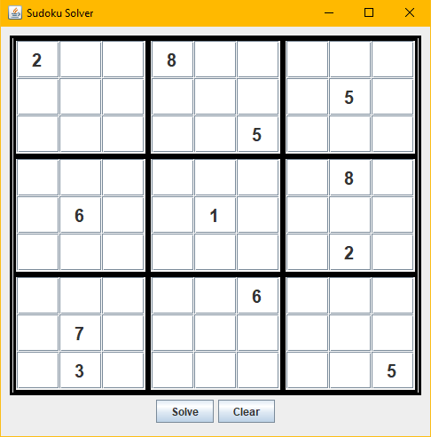

# SudokuSolver
3x3 sudoku solver

To compile:
javac SudokuGrid.java

To run:
java SudokuSolver
OR
double click on SudokuSolver.jar

NOTE:
SudokuSolver may take a few minutes to find invalid or unsolvable sudoku

